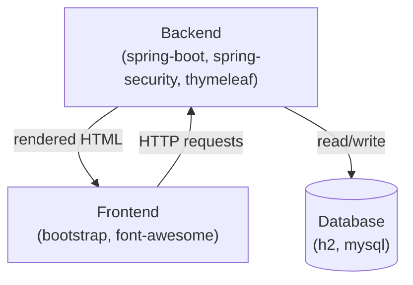

# AI Architecture Diagram Generator

A Python CLI tool that scans a local repository, detects technologies and architectural components, and generates a **Mermaid diagram** with a human-readable architecture summary.

It works in two passes:
1. **Rule-based detection** — fast, offline scan of config files, templates, source imports, and CI/CD pipelines.
2. **AI-enhanced analysis** (optional) — sends curated repo context to an LLM (OpenAI or Anthropic) for deeper insights, architecture style classification, and richer summaries.

The tool gracefully degrades: if no API key is set, it runs in rules-only mode with zero external dependencies.

## Quick Start

```bash
# Rules-only (no API key required)
python main.py /path/to/repo

# AI-enhanced with OpenAI
export OPENAI_API_KEY="sk-..."
python main.py /path/to/repo

# AI-enhanced with Anthropic
export ANTHROPIC_API_KEY="sk-ant-..."
python main.py /path/to/repo

# Force a specific provider / model
python main.py /path/to/repo --provider openai --model gpt-4o

# Explicitly disable AI (even if key is set)
python main.py /path/to/repo --no-ai

# Custom output file
python main.py /path/to/repo -o my_diagram.md
```

## Installation

```bash
pip install -r requirements.txt
```

The `openai` and `anthropic` packages are only needed for AI-enhanced mode. The tool works without them in rules-only mode.

## How It Works

### Pass 1: Rule-Based Detection

Walks the repo looking for:
- **Package managers** — `package.json`, `pom.xml`, `requirements.txt`, `go.mod`, `Cargo.toml`, etc.
- **Containers** — `Dockerfile`, `docker-compose.yml`
- **App config** — `application.properties`, `.env.example`
- **CI/CD** — `.github/workflows/*.yml`, `Jenkinsfile`, `.gitlab-ci.yml`
- **IaC** — `serverless.yml`, `*.tf` (Terraform)
- **API specs** — `openapi.yaml`, `swagger.json`
- **Templates** — HTML files in `templates/`, `views/`, `pages/` directories for CDN deps and template engine markers
- **Source imports** — lightweight scan of entry-point files for import statements

Technologies are matched against a curated keyword map and categorised into components: Frontend, Backend, Database, Authentication, Cloud Services, AI/ML, CI/CD, and more.

### Pass 2: AI-Enhanced Analysis

When an API key is available, the tool:
1. Builds a token-budgeted context window from the most architecturally informative files
2. Sends the context + rule-based results to the LLM
3. Receives structured JSON with additional technologies, component relationships, architecture style, and a narrative summary
4. Merges AI insights with rule-based findings (AI takes priority, rules fill gaps)

## CLI Reference

| Flag | Description |
|---|---|
| `repo` | Path to the local repository (required) |
| `-o`, `--output` | Output file path (default: `architecture_output.md`) |
| `--provider` | Force `openai` or `anthropic` |
| `--model` | Override the default model (e.g. `gpt-4o`, `claude-3-5-sonnet-latest`) |
| `--no-ai` | Disable AI analysis, use rules only |

## Environment Variables

| Variable | Description |
|---|---|
| `OPENAI_API_KEY` | OpenAI API key (enables OpenAI provider) |
| `ANTHROPIC_API_KEY` | Anthropic API key (enables Anthropic provider) |

When both keys are set and no `--provider` is specified, OpenAI is used by default.

## Project Structure

```
main.py                    CLI entry point, 2-pass pipeline, merge logic
detector.py                Rule-based technology detection
collector.py               Curated context builder for the LLM
llm_analyzer.py            Provider-agnostic LLM integration
diagram.py                 Mermaid diagram generation
summarizer.py              Architecture summary generation
config.py                  Configuration and API key management
build_knowledge_base.py    Data pipeline — fetches PyPI/npm metadata
data/seed_packages.json    Curated list of ~260 packages to index
data/knowledge_base.json   Auto-generated package → category mappings
requirements.txt           Dependencies
```

## Requirements

- Python 3.8+
- `openai>=1.0` (optional, for OpenAI provider)
- `anthropic>=0.40` (optional, for Anthropic provider)

## Example Output

Running the tool on a Spring Boot project:



## License

MIT
